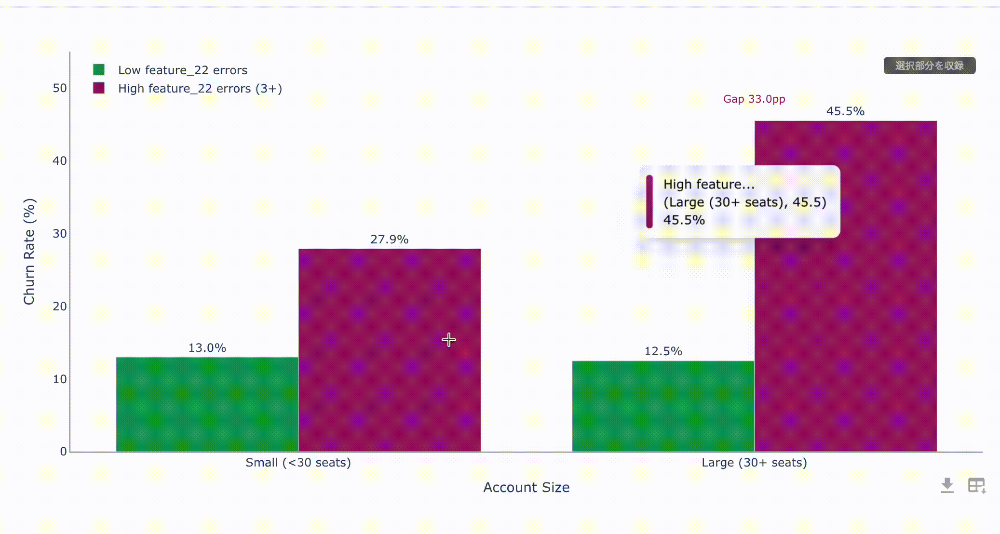
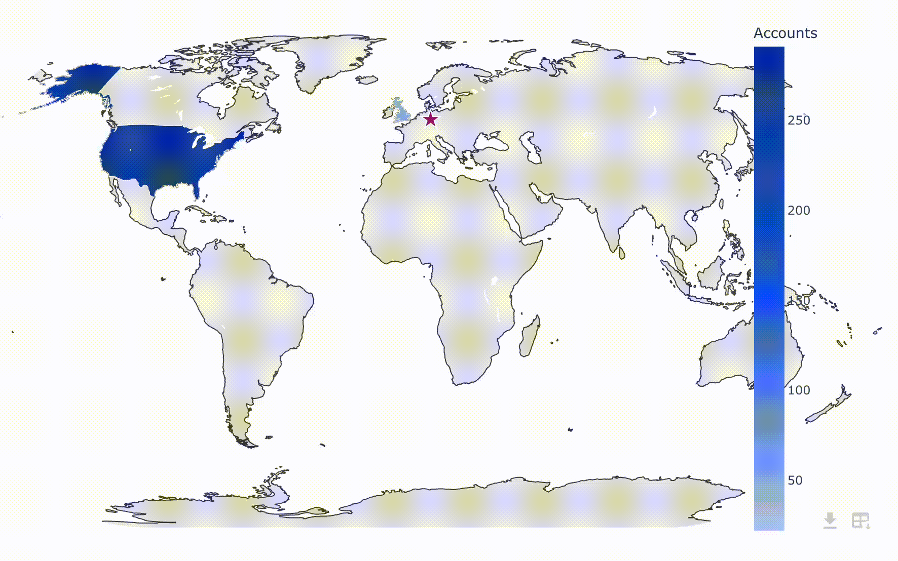

# Plotly Neo

[](https://www.npmjs.com/package/plotly-neo)
[](./LICENSE)

Plotly.js のグラフを、洗練されたホバーツールチップ・整理されたモードバー・ワンクリック CSV エクスポート・ダークモード対応でモダンに仕上げる軽量ラッパーです。React コンポーネントと、React 不要のスタンドアロン（UMD）版の両方を提供します。

English version: [README.md](./README.md)





## 特徴

- **カスタムホバーツールチップ** — Plotly 標準の SVG ホバーラベルを非表示にし、ホバー中のトレース色のアクセントバー付きのスタイリングされた HTML ツールチップに置き換えます。2D では 20% のパララックス効果でマウスに追従し、3D チャートにも対応します。
- **整理されたモードバー** — 表示されるボタンは「画像（PNG）ダウンロード」と「CSV ダウンロード」の 2 つだけ。ズーム／パン／選択などの標準ボタン群は CSS で非表示になり、モードバー自体はプロット右下に移動します。
- **クリップされないモードバーツールチップ** — Plotly 標準の疑似要素ツールチップの代わりに、`document.body` 直下に `position: fixed` で描画されるアニメーション付きツールチップを表示するため、`overflow: hidden` な祖先要素に切り取られません。
- **ワンクリック CSV エクスポート** — 各トレースの配列データを CSV としてダウンロード。UTF-8 BOM + CRLF 形式なので Excel でもそのまま開けます。
- **ダークモード** — 祖先要素に `.dark` クラスを付けるだけで有効になります（Tailwind のクラス方式と同じ考え方）。
- **自動リサイズ** — `ResizeObserver` でコンテナサイズを監視。React 版はコンテナが 0 でないサイズを持つまで描画を遅延するため、高さ 0 のチラつきが起きません。高さ未指定時のデフォルトは 400px です。
- **クリックの封じ込め** — モードバー上のクリックや Enter/Space キー操作は親要素に伝播しないため、クリック可能な領域の中にチャートを置いても誤動作しません。
- **React 不要のスタンドアロン版** — `Plotly.newPlot` などとほぼ同じシグネチャの命令的 API（UMD グローバル `PlotlyNeo`）を提供します。

## インストール

```bash
npm install plotly-neo
```

React で使う場合は、以下の peerDependencies をプロジェクト側でインストールしてください。

```bash
npm install react react-dom plotly.js react-plotly.js
```

| peerDependency | バージョン |
| --- | --- |
| `react` | >=18 |
| `react-dom` | >=18 |
| `plotly.js` | >=2 |
| `react-plotly.js` | >=2 |

CDN（スタンドアロン）で使う場合、React は不要です。Plotly.js 本体だけをページ側で読み込んでください（次節参照）。

パッケージのエントリポイントは次の 3 つです。

| インポート | 内容 |
| --- | --- |
| `plotly-neo` | React コンポーネント `PlotlyNeo` の名前付きエクスポートを持つ ES モジュール（デフォルトエクスポートなし） |
| `plotly-neo/style.css` | React 版用のスタイルシート（1 回だけインポート） |
| `plotly-neo/standalone` | UMD ビルド（`dist/plotly-neo.umd.js`）。`newPlot` / `react` / `relayout` / `restyle` / `update` / `purge` を公開 |

## クイックスタート（React）

`PlotlyNeo` は名前付きエクスポートです（デフォルトエクスポートはありません）。スタイルシートのインポートも忘れずに行ってください。

```jsx
import { PlotlyNeo } from "plotly-neo";
import "plotly-neo/style.css";

function App() {
  return (
    <PlotlyNeo
      data={[
        {
          x: [1, 2, 3],
          y: [2, 6, 3],
          type: "scatter",
          mode: "lines+markers",
        },
      ]}
      layout={{ title: { text: "Sample Chart" } }}
    />
  );
}
```

`PlotlyNeo` は [react-plotly.js](https://github.com/plotly/react-plotly.js#basic-props) の `Plot` コンポーネントと同じ props を受け取る、そのまま差し替え可能なラッパーです。

## クイックスタート（CDN・ビルド不要）

スタンドアロン版は Plotly.js を**バンドルしていません**。ページ側で読み込まれた `window.Plotly` を最初の API 呼び出し時に参照するため、先に Plotly.js 本体の `<script>` を読み込んでおいてください（見つからない場合はエラーを投げます）。

```html
<!-- 1) Plotly.js 本体 -->
<script src="https://cdn.plot.ly/plotly-3.0.1.min.js" charset="utf-8"></script>

<!-- 2) Plotly Neo（jsDelivr / npm 配信） -->
<link rel="stylesheet" href="https://cdn.jsdelivr.net/npm/plotly-neo/dist/plotly-neo.css">
<script src="https://cdn.jsdelivr.net/npm/plotly-neo/dist/plotly-neo.umd.js"></script>

<div id="myDiv" style="width:600px;height:400px;"></div>
<script>
  // Plotly.newPlot と同じシグネチャ: (要素または id, data, layout, config)
  PlotlyNeo.newPlot('myDiv', [
    { x: ['A', 'B', 'C'], y: [90, 40, 60], type: 'bar' }
  ], { title: { text: 'Sample' } });
</script>
```

本番環境では `https://cdn.jsdelivr.net/npm/plotly-neo@<バージョン>/dist/...` のようにバージョンを固定することを推奨します。動くサンプルは [`examples/cdn.html`](examples/cdn.html) を参照してください。

## API リファレンス

### React コンポーネント `<PlotlyNeo />`

react-plotly.js の `Plot` と同じ props をすべて受け取ります。TypeScript 型は次の通りです。

```ts
import { ComponentProps } from "react";
import Plot from "react-plotly.js";

export type PlotlyNeoProps = ComponentProps<typeof Plot>;
```

- `data` はそのまま `Plot` に渡されます。`layout` / `config` は後述のデフォルトとマージされます。
- `onInitialized(figure, plotDiv)` / `onUpdate(figure, plotDiv)` は、内部のモードバー・ツールチップ処理の**後に**呼ばれます（ユーザー指定のコールバックはそのまま使えます）。
- その他の props（イベントハンドラなど）はすべて `Plot` にパススルーされます。内部で `className="plotly-neo-wrapper"`・`useResizeHandler`・`style` を設定しているため、`className` を上書きすると本ライブラリのスタイルが適用されなくなる点に注意してください。
- 外側のコンテナは `min-height: 400px; position: relative` で描画され、`ResizeObserver` でサイズを監視します。アンマウント時には監視とツールチップが自動的に解除されます。

スタンドアロンエントリ（`plotly-neo/standalone`）には型定義がありません。

### スタンドアロン API（`window.PlotlyNeo`）

各関数の第 1 引数 `el` は要素の id 文字列または DOM 要素です（解決できない場合はエラーを投げます）。Plotly.js の同名メソッドに対応します。

| メソッド | 対応する Plotly API | 説明 |
| --- | --- | --- |
| `PlotlyNeo.newPlot(el, data, layout?, config?)` | `Plotly.newPlot` | 新規描画。グラフ div を resolve する Promise を返す |
| `PlotlyNeo.react(el, data, layout?, config?)` | `Plotly.react` | 差分更新。**未初期化のコンテナに対しては `newPlot` にフォールバック** |
| `PlotlyNeo.relayout(el, ...args)` | `Plotly.relayout` | layout の部分更新（引数はそのまま転送） |
| `PlotlyNeo.restyle(el, ...args)` | `Plotly.restyle` | trace の部分更新（引数はそのまま転送） |
| `PlotlyNeo.update(el, ...args)` | `Plotly.update` | layout / trace の同時更新（引数はそのまま転送） |
| `PlotlyNeo.purge(el)` | `Plotly.purge` | 描画を破棄し、ツールチップと `ResizeObserver` も解除 |

- `relayout` / `restyle` / `update` は、コンテナが未初期化の場合はエラーにならず `undefined` で resolve 済みの Promise を返します。
- 初回利用時、コンテナに `position: relative` と `min-height: 400px` を設定（未設定の場合のみ）し、内部に描画用の div を生成します。
- 公開されている関数は上記の 6 つがすべてです（`addTraces` や `downloadImage` などのラッパーはありません）。ESM から使う場合は `import PlotlyNeo from "plotly-neo/standalone"` でも同じオブジェクトを取得できます。

## 適用されるデフォルト

`layout` には次のデフォルトがマージされます。

| キー | デフォルト値 | ユーザーによる上書き |
| --- | --- | --- |
| `modebar` | `{ bgcolor: "transparent", color: "#999", activecolor: "#555" }` | 可（指定するとオブジェクト全体が置き換わります。ディープマージはされません） |
| `paper_bgcolor` | `"rgba(255,255,255, 0)"`（透明） | 可 |
| `autosize` | `true` | **不可（常に強制）** |
| `height` | `layout.height` → コンテナの実測高さ → `400` の順で決定 | `layout.height` を指定すればそれが優先 |
| `dragmode` | `"orbit"` | **不可（常に強制。ユーザー指定の `dragmode` は無視されます）** |

`config` には `{ displaylogo: false, responsive: true }` がマージされます（どちらもユーザー指定で上書き可能です）。

> **注意**: `dragmode: "orbit"` が常に強制され、かつズーム／パン系のモードバーボタンが非表示になるため、2D チャートのドラッグズーム・パン操作は実質的に無効になります。

## ダークモード

ダークモードは純粋に CSS で実現されており、**祖先要素の `.dark` クラス**で切り替わります。

```html
<html class="dark">
  <!-- この中のチャートはすべてダークモードで表示される -->
</html>
```

- ライブラリ自身がダークモードを検出・切り替えることはありません。`prefers-color-scheme` への対応や JS の API はなく、`.dark` クラスの管理はホストアプリの責任です（Tailwind の class 方式と同じ運用ができます）。
- 仕組みとしては、プロット全体（`.plot-container`）に `filter: invert(85%) hue-rotate(180deg)` を適用して明度を反転しつつ色相をおおむね保ちます。ホバーツールチップはこのフィルタの内側にあるため自動的に暗くなります。
- `body` 直下に描画されるモードバーツールチップはフィルタの外側にあるため、JS が `.dark` クラスをコピーし、CSS で明示的なダーク配色（背景 `#2c2c2c` / 文字 `#d9d9d9`）を当てます。

## CSV エクスポートとモードバー

### モードバー

- 表示されるボタンは「画像（PNG）ダウンロード」（Plotly 標準の `toImage` ボタン。アイコンのみ Material Design のダウンロードアイコンに差し替え）と、追加された「CSV ダウンロード」ボタンの 2 つだけです。
- それ以外の標準ボタン群（ズーム、パン、選択、軸リセットなど）は CSS で非表示になります。`config.modeBarButtonsToRemove` による削除ではないため、DOM 上にはボタンが残っています。
- モードバーはプロットの右下に配置され、ボタンのツールチップはアニメーション付きで `body` 直下に描画されます。

### CSV エクスポート

CSV ボタンをクリックすると、各トレースから次のプロパティのうち配列であるものが列としてエクスポートされます。

`x, y, z, labels, values, text, r, theta, lat, lon, locations, open, high, low, close`

- 複数トレースがある場合、ヘッダーにはトレース名（なければ `traceN`）がプレフィックスとして付きます（例: `Sales y`）。
- ヒートマップの `z` のような 2 次元配列は `z[0]`, `z[1]`, … のように列ごとに展開されます。
- 出力は CRLF 改行 + UTF-8 BOM 付きで、Excel で文字化けせずに開けます。セル内の `"` `,` 改行は適切にクオートされます。
- ファイル名は `layout.title`（または `title.text`）から `"<タイトル>-data.csv"` として生成され（ファイル名に使えない文字は `_` に置換）、タイトルがない場合は `data.csv` になります。
- エクスポート可能な配列が 1 つもない場合、クリックしても何も起こりません。
- 既知の制限: CSV ボタンの `aria-label` は日本語、ツールチップの表示テキストは英語（`Download data as csv`）にハードコードされています。

## 注意事項と制限

- **一部の文字列は日本語にハードコードされています。** CSV ボタンの `aria-label`（`データをCSV形式でダウンロード`）とスタンドアロン版のエラーメッセージ（`window.Plotly` 未読込・要素が解決できない場合）は日本語、CSV ボタンのツールチップ表示は英語（`Download data as csv`）です。ソースコメントも日本語です。
- **`dragmode` は常に `"orbit"`、`autosize` は常に `true` に強制**され、ユーザー指定は無視されます。ズーム／パン系ボタンも非表示のため、2D のドラッグズーム・パン操作は実質的に使えません。標準モードバーを復活させるオプションは現状ありません。
- **機能のオン／オフを切り替える props はありません。** ツールチップ・モードバー・CSV のカスタマイズは無効化できず、受け取る props は `react-plotly.js` の `Plot` と同一です。
- **最大化ビューは CSS の下地のみです。** スタイルシートにはモーダル／最大化表示用のクラス（`.plotly-neo-overlay`、`.js-plotly-plot.plotly-neo-plot.maximized`、`.modebar-btn--expand`）が含まれますが、展開ボタンの生成やクラスの付け外しを行う JavaScript は本ライブラリにはありません（`plotly-neo-plot` クラスの付与も含めて、ホストアプリ側で実装するためのフックです）。
- **ダークモードの自動検出はありません**（[ダークモード](#ダークモード)参照）。
- ルートエントリは ESM のみ（CommonJS ビルドなし）、スタンドアロンエントリは UMD のみで型定義はありません。

## 開発

リポジトリを clone して依存関係をインストールしてください。

```bash
npm install

# デモアプリの起動（Vite dev サーバー）
npm run dev

# ライブラリビルド（React 向け ES モジュール → dist/index.js, dist/index.css）
npm run build:lib

# スタンドアロン UMD ビルド（→ dist/plotly-neo.umd.js, dist/plotly-neo.css）
npm run build:standalone

# 両方まとめてビルド（prepare でも実行されます）
npm run build:all
```

ビルド済みの `dist/plotly-neo.umd.js` と `dist/plotly-neo.css` の 2 ファイルだけはリポジトリにコミットします（それ以外の `dist/` は `.gitignore` 対象です）。これは jsDelivr の GitHub 直配信（`https://cdn.jsdelivr.net/gh/<owner>/<repo>@<ref>/dist/plotly-neo.umd.js` 形式の `@gh` URL）でも配信できるようにするためです。クイックスタートで示した `/npm/` 形式の URL は、npm に公開されたパッケージ（`prepare` スクリプトが `dist/` を生成）から配信されます。`src/` を変更したら再ビルドしてコミットしてください。なお、デモアプリ用の `npm run build`（素の `vite build`）は `dist/` を空にしてしまうため、実行した場合はこの 2 ファイルを再ビルドしてください。

```bash
npm run build:standalone
git add dist/plotly-neo.umd.js dist/plotly-neo.css
git commit -m "rebuild CDN bundle"
```

## コントリビュート

バグ報告・機能提案は Issue へ、変更は Pull Request でお願いします。PR を送る前に `npm run lint` を実行し、`src/` の変更が CDN 配信物に影響する場合は上記の手順で `dist/plotly-neo.*` を再ビルドして含めてください。

## ライセンス

[MIT License](./LICENSE) © 2026 Shintaro Morimoto
