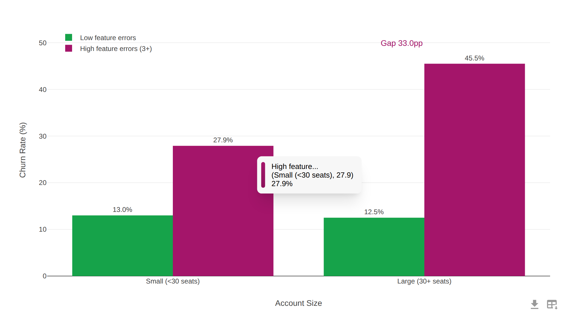
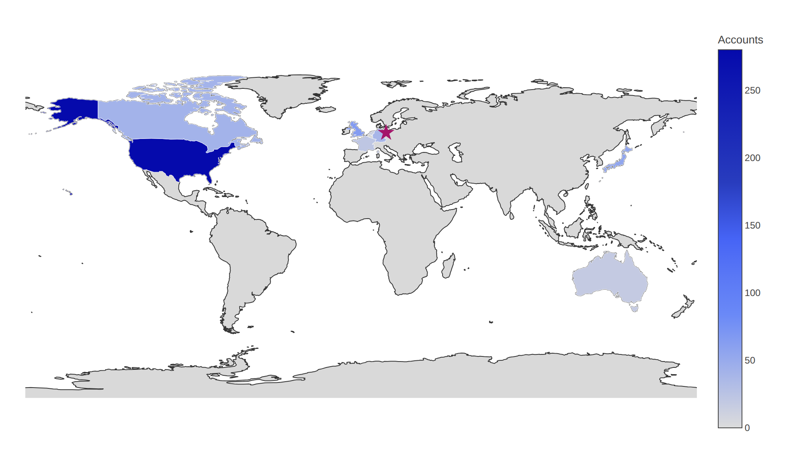

# Plotly Neo

A drop-in wrapper for [Plotly.js](https://plotly.com/javascript/) that restyles hover tooltips and the modebar, adds one-click CSV export, and plays nicely with dark mode — as a React component or a framework-free UMD script.

[](https://www.npmjs.com/package/plotly-neo)
[](./LICENSE)

日本語版は [README.ja.md](./README.ja.md) をご覧ください。





## What is Plotly Neo?

Plotly Neo takes a stock Plotly chart and layers a set of visual and UX refinements on top, without changing how you feed it data — the React component accepts exactly the same props as `react-plotly.js`'s `Plot`, and the standalone build mirrors the `Plotly.*` imperative API.

- **Restyled hover tooltips** — Plotly's native SVG hover labels are hidden and re-rendered as a rounded, softly shadowed HTML tooltip with a colored accent bar in the hovered trace's color, animated positioning, and a subtle mouse-follow parallax on 2D charts.
- **Refined modebar** — trimmed down to two buttons (image download with a Material Design icon, plus CSV export), repositioned to the bottom-right of the plot, with enlarged icons and hover transitions.
- **Animated modebar tooltips** — Plotly's CSS pseudo-element button tooltips are replaced with body-mounted, viewport-clamped tooltips that animate in with a springy easing and are never clipped by `overflow: hidden` ancestors.
- **One-click CSV export** — a modebar button that downloads the chart's underlying trace data as an Excel-friendly CSV (UTF-8 BOM, CRLF).
- **Maximize view (CSS hooks)** — the stylesheet ships opt-in classes for a modal/maximized chart view that a host app can wire up (see [Notes and limitations](#notes-and-limitations)).
- **Dark mode** — put the chart anywhere under a `.dark` ancestor (Tailwind-style class strategy) and the whole plot adapts via a CSS filter. No configuration needed.
- **Sensible defaults** — transparent paper background, no Plotly logo, responsive sizing, a 400px fallback height, and container-size tracking via `ResizeObserver`.
- **Two ways to use it** — a React component (`<PlotlyNeo />`) and a tiny framework-free UMD build (`PlotlyNeo.newPlot(...)`) that shares the same core code. React is not required for the UMD build.

## Installation

```bash
npm install plotly-neo
```

The React entry relies on peer dependencies that you install yourself:

| Peer dependency  | Version |
| ---------------- | ------- |
| `react`          | `>=18`  |
| `react-dom`      | `>=18`  |
| `plotly.js`      | `>=2`   |
| `react-plotly.js`| `>=2`   |

```bash
npm install react react-dom plotly.js react-plotly.js
```

If you only use the standalone/CDN build, none of the React peers are needed — just Plotly.js loaded on the page (see below).

Package entry points:

| Import | What you get |
| --- | --- |
| `plotly-neo` | ES module with the named export `PlotlyNeo` (React component). No default export. |
| `plotly-neo/style.css` | The stylesheet for the React entry. Import it once. |
| `plotly-neo/standalone` | The UMD build (`dist/plotly-neo.umd.js`), exposing `newPlot`, `react`, `relayout`, `restyle`, `update`, `purge`. |

## Quick start — React

```jsx
import { PlotlyNeo } from "plotly-neo";
import "plotly-neo/style.css";

function App() {
  return (
    <PlotlyNeo
      data={[
        {
          x: [1, 2, 3],
          y: [2, 6, 3],
          type: "scatter",
          mode: "lines+markers",
        },
      ]}
      layout={{ title: { text: "Sample Chart" } }}
    />
  );
}
```

`PlotlyNeo` is a drop-in replacement for `react-plotly.js`'s `Plot` — same `data`, `layout`, `config`, and event props. The chart fills its parent container and renders once the container has a measurable size.

## Quick start — CDN / no build step

The UMD build has no React dependency and does **not** bundle Plotly.js. Load Plotly first (it is read lazily from `window.Plotly`, so order only matters before your first `PlotlyNeo.*` call), then the Plotly Neo stylesheet and script:

```html
<!-- 1) Plotly.js from the official CDN -->
<script src="https://cdn.plot.ly/plotly-3.0.1.min.js" charset="utf-8"></script>

<!-- 2) Plotly Neo (jsDelivr) -->
<link rel="stylesheet" href="https://cdn.jsdelivr.net/npm/plotly-neo/dist/plotly-neo.css" />
<script src="https://cdn.jsdelivr.net/npm/plotly-neo/dist/plotly-neo.umd.js"></script>

<div id="myDiv" style="width: 600px; height: 400px;"></div>
<script>
  // Same signature as Plotly.newPlot: (element or id, data, layout, config)
  PlotlyNeo.newPlot("myDiv", [
    { x: ["A", "B", "C"], y: [90, 40, 60], type: "bar" },
  ], { title: { text: "Sample" } });
</script>
```

For production, pin a version in the URL (e.g. `https://cdn.jsdelivr.net/npm/plotly-neo@0.2.1/dist/plotly-neo.umd.js`) instead of relying on the latest tag.

A working example lives at [`examples/cdn.html`](examples/cdn.html).

## API reference

### React component: `<PlotlyNeo />`

Named export of the root entry (there is no default export):

```js
import { PlotlyNeo } from "plotly-neo";
```

**Props.** `PlotlyNeo` accepts the full prop surface of `react-plotly.js`'s `Plot` component — see the [react-plotly.js docs](https://github.com/plotly/react-plotly.js#basic-props). The TypeScript type is exported as `PlotlyNeoProps` (an alias for `ComponentProps<typeof Plot>`).

How the props are handled:

- `data` — passed through untouched.
- `layout` / `config` — merged with the library defaults before reaching Plotly (see [Defaults applied](#defaults-applied)).
- `onInitialized(figure, graphDiv)` — wrapped: the library first customizes the modebar and sets up the custom hover tooltip, then calls your callback.
- `onUpdate(figure, graphDiv)` — wrapped: the library re-applies the modebar customization (the hover tooltip is not rebuilt on updates), then calls your callback.
- Every other prop is spread onto the underlying `Plot` last, so it can also override the internally set `useResizeHandler={true}`, `style={{ width: "100%", height: "100%" }}`, and `className="plotly-neo-wrapper"`. Avoid overriding `className` — all of the library's CSS is scoped to `.plotly-neo-wrapper`, so replacing it disables the custom styling.

**Rendering behavior.** The component renders an outer `<div>` with `min-height: 400px; position: relative` and observes it with a `ResizeObserver`. The inner `Plot` mounts only after the container has measured a nonzero width and height, which avoids a zero-height flash. On unmount, the observer and the tooltip machinery are disconnected.

### Standalone / UMD: `PlotlyNeo.*`

The UMD build registers the global `PlotlyNeo` (or import the same object via `plotly-neo/standalone`). Every function takes `el` as either an element id string or a DOM element; an unresolvable element throws. On first use of a container, the library sets `position: relative` and `min-height: 400px` on it (only if unset) and draws into an internally created inner `div.plotly-neo-wrapper`, mirroring the React DOM structure.

| Function | Plotly equivalent | Semantics |
| --- | --- | --- |
| `PlotlyNeo.newPlot(el, data, layout?, config?)` | `Plotly.newPlot` | Draws a new chart with the merged defaults applied. Returns a `Promise` resolving to the graph div. Also wires up the modebar customization (re-applied on every `plotly_afterplot`), the custom hover tooltip, and a `ResizeObserver` that calls `Plotly.Plots.resize`. |
| `PlotlyNeo.react(el, data, layout?, config?)` | `Plotly.react` | Diff-based update with the same layout/config merging. Falls back to `newPlot` if the container was never initialized. Re-applies the modebar customization; the existing hover tooltip is kept. |
| `PlotlyNeo.relayout(el, ...args)` | `Plotly.relayout` | Forwards verbatim. Returns a resolved `Promise` (with `undefined`) if the container was never initialized. |
| `PlotlyNeo.restyle(el, ...args)` | `Plotly.restyle` | Same forwarding and fallback behavior as `relayout`. |
| `PlotlyNeo.update(el, ...args)` | `Plotly.update` | Same forwarding and fallback behavior as `relayout`. |
| `PlotlyNeo.purge(el)` | `Plotly.purge` | Disconnects the tooltip and the `ResizeObserver`, purges the chart, and removes the inner div. No-op if not initialized. |

These six functions are the complete standalone API. Plotly.js itself is **not** bundled — `window.Plotly` must be present by the time you make the first call, or an error is thrown.

### TypeScript

The root entry ships hand-written declarations: the `PlotlyNeo` component and the `PlotlyNeoProps` type. The standalone entry is currently untyped.

## Defaults applied

Layout defaults (`layout` is shallow-merged; deep keys are not merged):

| Key | Default | Overridable? |
| --- | --- | --- |
| `modebar` | `{ bgcolor: "transparent", color: "#999", activecolor: "#555" }` | Yes — but a user-supplied `layout.modebar` replaces this object entirely (shallow merge) |
| `paper_bgcolor` | `"rgba(255,255,255, 0)"` (fully transparent) | Yes |
| `autosize` | `true` | **No** — always forced |
| `height` | your `layout.height`, else the measured container height, else `400` | Your `layout.height` wins |
| `dragmode` | `"orbit"` | **No** — always forced; a user-supplied `dragmode` is overridden (see [Notes and limitations](#notes-and-limitations)) |

Config defaults (both user-overridable):

| Key | Default |
| --- | --- |
| `displaylogo` | `false` |
| `responsive` | `true` |

There are no other defaults — no locale bundles, color palettes, font settings, templates, or margin overrides.

## Dark mode

Dark mode is driven entirely by CSS, keyed off an ancestor element with the class `dark` (the Tailwind class strategy). Add `class="dark"` to `<html>`, `<body>`, or any wrapper around the chart:

```html
<html class="dark">
  <!-- every Plotly Neo chart on the page renders in dark mode -->
</html>
```

What happens:

- The plot container receives `filter: invert(85%) hue-rotate(180deg)` — a filter-based theme that inverts lightness while roughly preserving hues. The custom hover tooltip lives inside the filtered subtree, so it darkens automatically.
- The modebar tooltips are mounted on `document.body` (outside the filter), so they get explicit dark colors instead (`#2c2c2c` background, `#d9d9d9` text); the library copies the `dark` class onto them when the chart sits under a `.dark` ancestor.

The library never detects or toggles dark mode itself — there is no `prefers-color-scheme` handling and no theme prop. Your app owns the `.dark` class.

## CSV export and modebar details

### Modebar

After every render, the modebar is reduced to exactly two buttons:

1. **Image download** — Plotly's stock "download plot as png" button, with its icon swapped for a Material Design download arrow. Behavior is unchanged.
2. **CSV download** — a new button (`.modebar-btn--csv`) that exports the chart's trace data as a CSV file.

All other modebar groups (zoom, pan, box/lasso select, autoscale, reset axes, hover-mode toggles, and their 3D equivalents) are hidden via a CSS class — not via `config.modeBarButtonsToRemove`, so the buttons still exist in the DOM. The modebar is repositioned to the bottom-right of the plot, and `click` / `Enter` / `Space` events on it do not propagate to ancestors, so a chart placed inside a clickable area will not trigger the parent when its buttons are used.

Button tooltips are rendered by the library as animated, `position: fixed` elements appended to `document.body` (`.plotly-neo-modebar-tooltip`), horizontally clamped to the viewport — they cannot be clipped by `overflow: hidden` ancestors, which is the reason Plotly's own pseudo-element tooltips are disabled.

### CSV export

Clicking the CSV button exports every array-like property among `x, y, z, labels, values, text, r, theta, lat, lon, locations, open, high, low, close` from each trace as a column:

- With multiple traces, headers are prefixed with the trace `name` (or `traceN`), e.g. `Sales y`.
- 2D arrays (e.g. heatmap `z`) expand to one column per matrix column: `z[0]`, `z[1]`, ...
- Output uses CRLF line endings, proper quoting, and a UTF-8 BOM so Excel opens it without mojibake. `Date` values become ISO strings; `null`/`undefined` become empty cells.
- Filename is `<chart title>-data.csv` (from your `layout.title`, with filesystem-unsafe characters replaced by `_`), or `data.csv` when the chart has no title.
- If no exportable arrays are found, the click silently does nothing.

CSV export is only available through the modebar button; there is no programmatic export function.

### Hover tooltips

Plotly's native hover labels (2D and 3D) are hidden via CSS and mirrored into a styled HTML tooltip:

- A `MutationObserver` watches Plotly's hover layer and copies the label text, position, font size, and trace color into a `div.custom-tooltip`.
- The trace color becomes a rounded accent bar on the tooltip's left edge (via the CSS custom property `--tooltip-accent`).
- Position changes animate with a CSS transition; on 2D charts the tooltip additionally drifts by 20% of the cursor's distance from the hover anchor (a light parallax). On 3D charts the tooltip is offset from the hovered point.
- When hovering ends, the tooltip fades out after 300 ms.

## Notes and limitations

- **Some strings are Japanese-only.** The CSV button's `aria-label` is Japanese (`データをCSV形式でダウンロード`) while its visible tooltip is English (`Download data as csv`); the standalone build's error messages (missing `window.Plotly`, unresolvable element) are Japanese; source comments are Japanese. Stock modebar button tooltips use Plotly's English defaults.
- **`dragmode` is always forced to `"orbit"`** and `autosize` to `true`; user-supplied values for these are ignored. Combined with the hidden zoom/pan buttons, 2D drag-zoom and pan interactions are effectively unavailable, and there is currently no option to re-enable the standard modebar buttons.
- **Feature toggles do not exist.** The tooltip, modebar, and CSV customizations cannot be disabled via props; the component accepts no props beyond those of `react-plotly.js`'s `Plot`.
- **Maximize view is CSS scaffolding only.** The stylesheet ships classes for a modal/maximized chart (`.plotly-neo-overlay` backdrop, `.js-plotly-plot.plotly-neo-plot.maximized`, `.modebar-btn--expand` button styling), but no JavaScript in this library creates the expand button or toggles those classes — and the maximize styles target a `plotly-neo-plot` class the library does not assign. They are hooks for a host app to wire up itself.
- **No automatic dark-mode detection** — see [Dark mode](#dark-mode).
- The root entry is ESM-only (no CommonJS build); the standalone entry is UMD-only and untyped.

## Development

Clone the repository, then:

```bash
npm install

# Run the demo app (Vite dev server)
npm run dev

# Library build for React consumers (ES module -> dist/index.js + dist/index.css)
npm run build:lib

# Framework-free UMD build (-> dist/plotly-neo.umd.js + dist/plotly-neo.css)
npm run build:standalone

# Both, in order (lib first, then standalone)
npm run build:all
```

`dist/plotly-neo.umd.js` and `dist/plotly-neo.css` are the only build outputs committed to the repository. They exist so the bundle can also be served straight from the Git repository via jsDelivr's `@gh` URLs (`https://cdn.jsdelivr.net/gh/<owner>/<repo>@<ref>/dist/plotly-neo.umd.js`); the `/npm/` URLs shown in the quick start are served from the published npm package instead, whose `dist/` is generated by the `prepare` script. After changing anything under `src/`, rebuild and commit the two files:

```bash
npm run build:standalone
git add dist/plotly-neo.umd.js dist/plotly-neo.css
git commit -m "rebuild CDN bundle"
```

The remaining `dist/` files are gitignored; the `prepare` script runs `build:all`, so installs from git generate `dist/index.js` / `dist/index.css` automatically. Note that `npm run build` (the plain demo-app build) empties `dist/`, including the two committed CDN files — rebuild them afterwards if you ran it.

## Contributing

Issues and pull requests are welcome. If you plan a larger change, please open an issue first to discuss the approach. When your change touches `src/`, remember to rebuild the committed CDN bundle (see [Development](#development)).

## License

[MIT](./LICENSE) © 2026 Shintaro Morimoto
